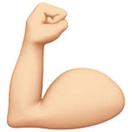

On this page, you will find my **professional web page**. Please, keep in mind that it is ==under construction==. I apology for any inconveniences it may cause you.
Also, I included the *Contact form* just to add more elements to my page, but I did not include the PHP script. Thus, the form does not work.

Let's work together :flexed biceps:[^1] to improve this page! Does it sound good to you? If so, feel free to contact me at [e-mail address] (sonia.lopez@etu.unige.ch) if:
1. You spot a typo or a grammar mistake :see-no-evil monkey:.
2. You have comments or suggestions to improve this page.
3. You have a service suggestion.
4. You would like to collaborate with me professionally.

[^1]: Meaning of the flexed biceps emoji: The brawny arm of the flexed biceps emoji is used to represent all sorts of strength and power, from physical might to mental determination [...]. Source: [Flexed biceps' meaning source](https://www.dictionary.com/e/emoji/flexed-biceps-emoji/). The adage says *a picture is worth thousand words*, so here it goes 